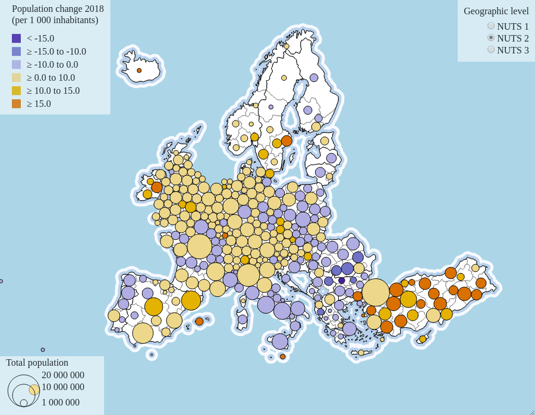

# NutsDorlingCartogram
Dorling cartogram from NUTS regions with Eurostat statistics

<div>

<div>
  
## [Live Demo](https://eurostat.github.io/NutsDorlingCartogram/examples/basic/)

## Installation

'npm install nutsdorlingcartogram'

then 
```javascript
NutsDorlingCartogram = require("nutsdorlingcartogram")
```

or

```javascript
<script src="https://unpkg.com/nutsdorlingcartogram/build/dorling.min.js"></script>
```

## Usage

```javascript
NutsDorlingCartogram.dorling()
  .svgId("dorlingSvg")
  .width(900)
  .height(700)
  .nutsLvl(2)
  .circleExaggerationFactor(0.8)
  .colors(["#2d50a0", "#6487c3", "#aab9e1", "#f0cd91", "#e6a532", "#d76e2d"])
  .thresholdValues([-15, -10, 0, 10, 15, 20])
  .legend({
    title: "Population change",
    orient: "vertical",
    shape: "rect",
    shapeRadius: 10,
    labelAlign: "middle",
    labelOffset: 10,
    labelUnit: " ‰ "
  })
  .scale(1000)
  .rotateX(-10)
  .rotateY(-61)
  .translateX(400)
  .translateY(216)
  .build()
});
```
Check out [this notebook](https://observablehq.com/@joewdavies/nuts-dorling-cartogram-npm-package) for an interactive example.

# Cartogram Definition

Method | Description | Type | Required | Default Value
:--------- | :--------- | :--------- | :--------- | :---------
dorling.**svgId** | Identifier of the target SVG element | string | true | null
dorling.**width** | Width of the visualization | number | false | 900
dorling.**height** | Height of the visualization | number | false | 500
dorling.**nutsLvl** | NUTS level | number | false | 2
dorling.**sizeDatasetCode** | [Eurostat database](https://ec.europa.eu/eurostat/data/database) dataset identifier used to determine circle sizes  | string | false | "demo_r_pjangrp3"
dorling.**sizeDatasetFilters** | URL parameter string to apply to the sizeDataset request  | string | false | "sex=T&age=TOTAL&unit=NR&time=2018"
dorling.**colorDatasetCode** | Eurostat dataset identifier used to determine circle colors | number | false | 200
dorling.**colorDatasetFilters** | URL parameter string to apply to the colorDataset request  | string | false | "indic_de=GROWRT&time=2018"
dorling.**colorScheme** | [d3 scale chromatic](https://github.com/d3/d3-scale-chromatic) function name. Only used when a 'colors' array is not specified | string | false | "interpolateRdYlBu"
dorling.**colors** | An array of hex values to use for colouring the circles | []string | false | null
dorling.**thresholdValues** | An array of threshold values to use for categorising the data | []number | false | null
dorling.**zoom** | Enable d3 zoom | boolean | false | true
dorling.**legend** | Object which stores the configuration parameters for the legend. See [here](https://d3-legend.susielu.com/#color) for more details on the following legend options. | object | false | See [here](https://d3-legend.susielu.com/#color) 
&nbsp;&nbsp; legend.orient | Accepted values: "vertical" or "horizontal" | string | false | "vertical"
&nbsp;&nbsp; legend.title | Legend title text | string | false | "Legend"
&nbsp;&nbsp; legend.titleWidth | Width of the legend title | number | false | 200
&nbsp;&nbsp; legend.cells | Number of cells to be shown in the legend | number | false | 5
&nbsp;&nbsp; legend.shape | Shape of the legend cells ("circle" or "rect") | string | false | "rect"
&nbsp;&nbsp; legend.shapeRadius | Radius of the circle when legend.shape is set to "circle" | string | false | null
&nbsp;&nbsp; legend.shapePadding | Padding to be applied to the legend cells for spacing | number | false | 5
&nbsp;&nbsp; legend.labelAlign | Alignment of the legend cell labels. | string | false | "middle"
&nbsp;&nbsp; legend.labelOffset | Distance in pixels from legend label to its corresponding cell | number | false | 5
dorling.**circleExaggerationFactor** | Value used to exaggerate circle radiuses | number | false | 0.8
dorling.**collisionPadding** | Padding to apply between each circle. Used in [d3's force simulation](https://github.com/d3/d3-force). | number | false | 0.2
dorling.**positionStrength** | The strength of the forces used to maintain the circle at its original position. | number | false | 3
dorling.**collisionStrength** | The strength of the collisions between circle during the d3 force simulation | number | false | 0.1
dorling.**scale** | d3-geo projection.scale() value | number | false | 1000
dorling.**rotateX** | d3-geo projection.rotate() X value | number | false | -13
dorling.**translateX** | d3-geo projection.translate() X value | number | false | null
dorling.**translateY** | d3-geo projection.translate() Y value | number | false | null

