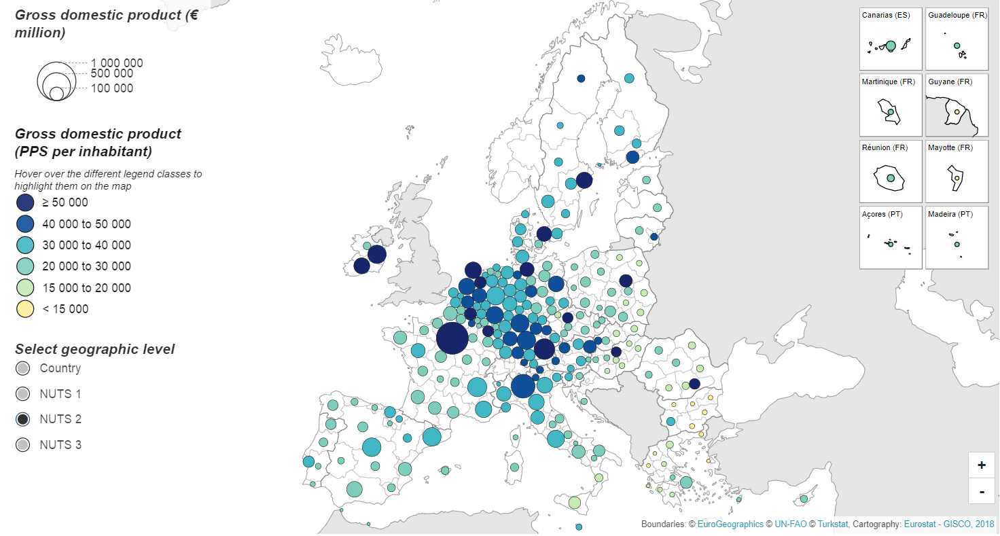

# NutsDorlingCartogram
Dorling cartograms from NUTS regions with Eurostat statistics


<div>
  <a href="https://eurostat.github.io/NutsDorlingCartogram/examples/dorling/" target="_blank">
    
  </a>
<div>
  
## Examples

* [Population without borders](https://eurostat.github.io/NutsDorlingCartogram/examples/dorling/)  
* [Population](https://eurostat.github.io/NutsDorlingCartogram/examples/population/)  
* [GDP](https://eurostat.github.io/NutsDorlingCartogram/examples/gdp/)  
* [Tourism](https://eurostat.github.io/NutsDorlingCartogram/examples/tourism/)  
* [Agriculture](https://eurostat.github.io/NutsDorlingCartogram/examples/agriculture/)  

## Installation

```properties
npm install nutsdorlingcartogram
```  

then 
```javascript
NutsDorlingCartogram = require("nutsdorlingcartogram")
```

or

```javascript
<script src="https://unpkg.com/nutsdorlingcartogram/build/dorling.min.js"></script>
```

## Usage

```javascript
        NutsDorlingCartogram.dorling()
            .containerId("containerDiv")
            .nutsLevel(2)
            .colors(["#2d50a0", "#6487c3", "#aab9e1", "#f0cd91", "#e6a532", "#d76e2d"])
            .thresholdValues([-15, -10, 0, 10, 15, 20])
            .sizeDatasetCode("demo_r_pjangrp3")
            .sizeDatasetFilters("sex=T&age=TOTAL&unit=NR&time=2019")
            .colorDatasetCode("demo_r_gind3")
            .colorDatasetFilters("indic_de=GROWRT&time=2018")
            .maxCircleRadius({
                "0": 50, // Country level
                "1": 30, // NUTS 1
                "2": 30, // NUTS 2
                "3": 20  // NUTS 3
            })
            .showBorders(false)
            .seaColor("white")
            .build();
```
Check out [this notebook](https://observablehq.com/@joewdavies/nuts-dorling-cartogram-npm-package) for an interactive example.

# Cartogram Definition

Accessible methods and their respective parameters. Where possible, values can be defined for each NUTS level; whereby a change in NUTS level using the NUTS selector will rebuild the visualization using the parameters corresponding to the new NUTS level.

Method | Description | Type | Required | Default Value
:--------- | :--------- | :--------- | :--------- | :---------
dorling.**containerId** | Identifier of the container upon which the cartogram will be appended | string | true | null
dorling.**width** | SVG viewbox width attribute | number | false | 1000
dorling.**height** | SVG viewbox height attribute | number | false | 1000
dorling.**nutsLevel** | NUTS level | number | false | 2
dorling.**sizeDatasetCode** | [Eurostat database](https://ec.europa.eu/eurostat/data/database) dataset identifier used to determine circle sizes  | string | false | "demo_r_pjangrp3"
dorling.**sizeDatasetFilters** | URL parameter string to apply to the sizeDataset request  | string | false | "sex=T&age=TOTAL&unit=NR&time=2018"
dorling.**colorDatasetCode** | Eurostat dataset identifier used to determine circle colors | number | false | 200
dorling.**colorDatasetFilters** | URL parameter string to apply to the colorDataset request  | string | false | "indic_de=GROWRT&time=2018"
dorling.**mixNuts** | Permits filling in data gaps using data from different NUTS levels. For example: this adds NUTS region "DE1" of NUTS level 1 to the NUTS 2 data: { 2: {level: 1, ids: ["DE1"] } } | { nutsLevel: {nutsLevelToBeAdded: number, ids: [] } } | false | null 
dorling.**exclude** | Exclude countries from the data shown. e.g .exclude(["MK", "ME", "TR", "AL", "RS"])  | [string] | false | null  
dorling.**colorIsPercentage** | Whether or not the values used for the colours should be percentages. If true, the percentages are calculated using colorPercentageCalcDatasetCode and colorPercentageCalcDatasetFilters | boolean | false | false  
dorling.**colorPercentageCalcDatasetCode** | Dataset code for the retrieval of the totals that will be used to calculate the percentages of the colour values. See agriculture example (specific cereal production / all cereal production) | string | false | null
dorling.**colorPercentageCalcDatasetFilters** | URL parameter string to apply to the colorPercentageCalcDataset request | string | false | null
dorling.**colorScheme** | [d3 scale chromatic](https://github.com/d3/d3-scale-chromatic) function name. Only used when a 'colors' array is not specified (see below) | string | false | "interpolateRdYlBu"
dorling.**colors** | An array of hex values to use for colouring the circles | []string | false | null
dorling.**thresholdValues** | An array of threshold values to use for classifying the data | []number | false | null
dorling.**zoom** | Enable d3 zoom functionality using zoom buttons | boolean | false | true
dorling.**colorLegend** | Object which stores the configuration parameters for the circle-color legend. See [here](https://d3-legend.susielu.com/#color) for more details on the following legend options. | object | false | See [here](https://d3-legend.susielu.com/#color) 
&nbsp;&nbsp; colorLegend.orient | Accepted values: "vertical" or "horizontal" | string | false | "vertical"
&nbsp;&nbsp; colorLegend.title | Legend title text | string | false | "Circle Colour"
&nbsp;&nbsp; colorLegend.titleWidth | Width of the legend title | number | false | 200
&nbsp;&nbsp; colorLegend.cells | Number of cells to be shown in the legend | number | false | 5
&nbsp;&nbsp; colorLegend.shape | Shape of the legend cells ("circle" or "rect") | string | false | "rect"
&nbsp;&nbsp; colorLegend.shapeRadius | Radius of the circle when colorLegend.shape is set to "circle" | string | false | null
&nbsp;&nbsp; colorLegend.shapePadding | Padding to be applied to the legend cells for spacing | number | false | 5
&nbsp;&nbsp; colorLegend.labelAlign | Alignment of the legend cell labels. | string | false | "middle"
&nbsp;&nbsp; colorLegend.labelOffset | Distance in pixels from legend label to its corresponding cell | number | false | 5
&nbsp;&nbsp; colorLegend.titleYOffset | Y-axis translation applied to the hover functionality explanation text | {'nutsLevel':number} | false | { 0: 330, 1: 330, 2: 330, 3: 330 }  
dorling.**sizeLegend** | Object which stores the configuration parameters for the circle-size legend | object | false |  
&nbsp;&nbsp; sizeLegend.title | Legend title | string | false | "Circle Size"  
&nbsp;&nbsp; sizeLegend.values | Array of values used in the legend | {'nutsLevel':array} | false | [maxValue, maxValue / 2, maxValue / 10] for each NUTS level   
&nbsp;&nbsp; sizeLegend.textFunction | Function used to manipulate legend labels | function | false |  function (value) { return value.toLocaleString() }    
&nbsp;&nbsp; sizeLegend.titleYOffset | Y Offset in pixels applied to the legend's title | {'nutsLevel':number} | false |  { '0': 10, '1': 10, '2': 10, '3': 10 }
&nbsp;&nbsp; sizeLegend.titleXOffset | X Offset in pixels applied to the legend's title | {'nutsLevel':number} | false | { '0': 20, '1': 20, '2': 20, '3': 20 }  
&nbsp;&nbsp; sizeLegend.translateY | Y value to be applied to the translate transform of the size legend within the parent "legends" container | {'nutsLevel':number} | false | { '0': 0, '1': 0, '2': 0, '3': 0 }  
&nbsp;&nbsp; sizeLegend.bodyXOffset | Legend title | {'nutsLevel':number} | false | { '0': 50, '1': 50, '2': 50, '3': 50 }   
&nbsp;&nbsp; sizeLegend.bodyYOffset | Legend title | {'nutsLevel':number} | false | { '0': 90, '1': 90, '2': 90, '3': 90 }    
&nbsp;&nbsp; sizeLegend.labelsTranslateX | X-axis translation applied to the labels of each size class | {'nutsLevel':number} | false | { '0': 90, '1': 90, '2': 90, '3': 90 }  
&nbsp;&nbsp; sizeLegend.labelsOffsetY | Y-axis offset applied to labels | {'nutsLevel':number} | false | { '0': 2, '1': 2, '2': 2, '3': 2 }  
dorling.**tooltip** | Object which stores the configuration parameters for the circle-size legend | object | false |  
&nbsp;&nbsp; tooltip.colorLabel | Label used to describe the color value of the feature | string | false | "Color value:"  
&nbsp;&nbsp; tooltip.colorUnit | Unit label to be added after the color value | string | false | ""    
&nbsp;&nbsp; tooltip.sizeLabel | Label used to describe the size value of the feature | string | false |  "Size value:"  
&nbsp;&nbsp; tooltip.sizeUnit | Unit label to be added after the size value | string | false | ""
&nbsp;&nbsp; tooltip.shareLabel | Label used to describe the percentage share value of the feature | string | false | "Share value:"  
dorling.**showNutsSelector** | whether or not to show the radio buttons which allow the user to change between NUTS levels | boolean | false | true;
dorling.**nutsAvailable** | Defines which NUTS levels will be shown in the NUTS level selector | array | false | [0,1,2,3];
dorling.**nutsSelectorTranslateY** | Y-axis translation applied to the NUTS level selector node | {'nutsLevel':number} | false | { 0: 375, 1: 375, 2: 375, 3: 375 }    
dorling.**minCircleRadius** | Minimum circle radius allowed when scaling the circles (for each NUTS level) | {'nutsLevel':number} | false | { '0': 1.5, '1': 1.5, '2': 1.5, '3': 1.5 }  
dorling.**maxCircleRadius** | Maximum circle radius allowed when scaling the circles (for each NUTS level) | {'nutsLevel':number} | false | { '0': 20, '1': 20, '2': 20, '3': 20 }  
dorling.**positionStrength** | The strength of the forces used to maintain the circle at its original position. | number | false | 0.7  
dorling.**collisionStrength** | The strength of the collisions between circle during the d3 force simulation | number | false | 0.1  
dorling.**scale** | d3-geo projection.scale() value | number | false |  0.0002065379208173783    
dorling.**translateX** | d3-geo projection.translate() X value | number | false | -390  
dorling.**translateY** | d3-geo projection.translate() Y value | number | false | 1126  
dorling.**showSource** | show links to the source datasets for the colour and size data | boolean | false | true  
dorling.**footnotesText** | Footnote text shown below the map | string | false | null  

